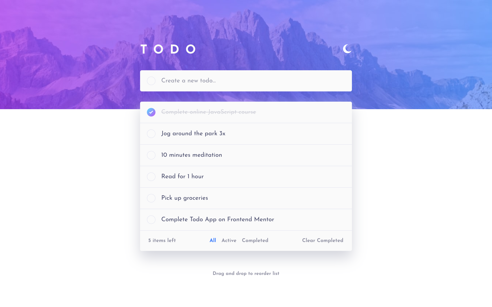
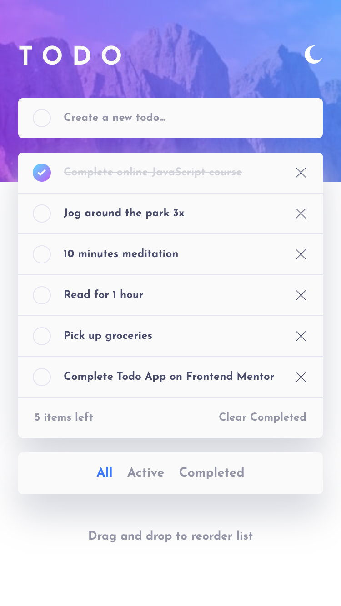
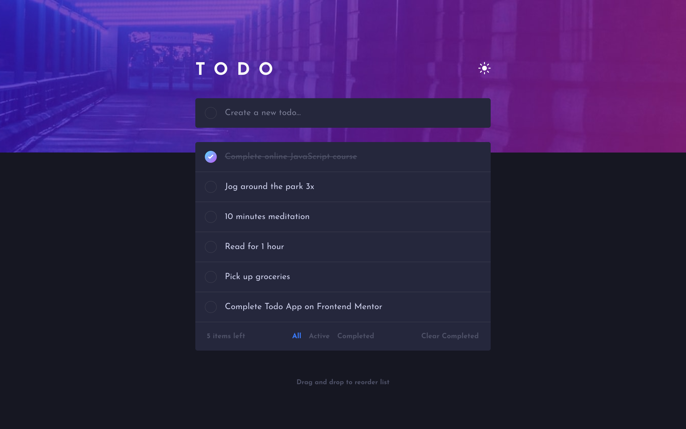
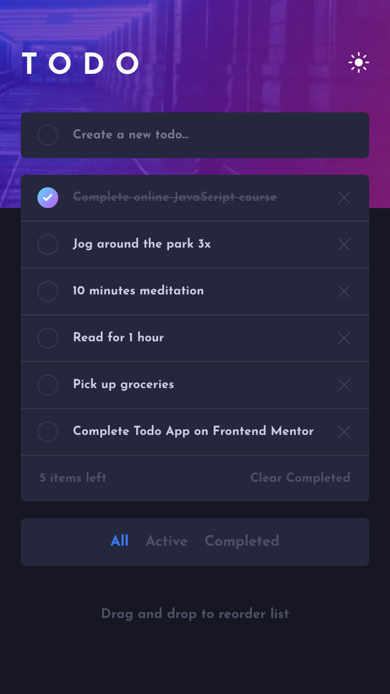

# Frontend Mentor - Todo app solution

This is a solution to the [Todo app challenge on Frontend Mentor](https://www.frontendmentor.io/challenges/todo-app-Su1_KokOW).

## Table of contents

- [Overview](#overview)
  - [The challenge](#the-challenge)
  - [Screenshot](#screenshot)
  - [Links](#links)
- [My process](#my-process)
  - [Built with](#built-with)
  - [What I learned](#what-i-learned)
- [Author](#author)

## Overview

### The challenge

Users should be able to:

- View the optimal layout for the app depending on their device's screen size
- See hover states for all interactive elements on the page
- Add new todos to the list
- Mark todos as complete
- Delete todos from the list
- Filter by all/active/complete todos
- Clear all completed todos
- Toggle light and dark mode
- **Bonus**: Drag and drop to reorder items on the list

### Screenshot

  
Desktop Light

  

  
Mobile Light

  

  
Desktop Dark

  

  
Mobile Dark

  

### Links

- Solution URL: [GitHub repo](https://github.com/hanna-skryl/todo-list)
- Live Site URL: [GitHub Pages](https://hanna-skryl.github.io/todo-list/)

## My process

### Built with

- Semantic HTML5 markup
- CSS custom properties
- Mobile-first workflow
- [Angular](https://angular.io/)

### What I learned

This challenge gave me an opportunity to experiment with NgRx SignalStore and the light/dark mode toggle.

## Author

- GitHub - [Hanna Skryl](https://github.com/hanna-skryl)
- Frontend Mentor - [@hanna-skryl](https://www.frontendmentor.io/profile/hanna-skryl)
- Twitter - [@hanna_skryl](https://twitter.com/hanna_skryl)
